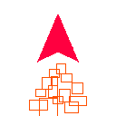
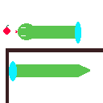

## Small Games

This repo contains small games which can be played only using a directional pad and 
an action button. You should also never need to press two buttons simultaneously (this is 
useful for devices which uses a TV like remote, such as Android TV)

### Games
#### Pong
The first game is a simple game of pong, where the player moves the paddle to try and hit the
ball. A few shaders are added to enhance the visual quality of the game and give it a CRT retro
feel. Once a score of 3 points is hit the game ends.

#### Bullet Hell
A simple bullet hell where the player can swap colors to avoid being hit. In the first image, the
player may pass undamaged through the red bullets, as they are of the same color. In the second,
however, the player will be hit by the blue bullets and take damage, as they are not of the same
color.

The player ship automatically shoots without user input. The directional keys are used to move
and the accept button is used to change colors. The player may pickup up to 3 extras weapons besides
the default one. The player can take up to 3 damage.

The default weapon simply shoots upwards

The second bullet tracks lightly the enemies above the player

The third is a cross that shoots into the nearest enemy and comes back

The fourth shoots bullets downwards, as if it is the engines fire

There are 4 enemy types and a final boss. The final boss appears after 10 minutes of play time 
and once defeated the player may save his score. The enemies spawn location is randomized.

The fist enemy is simple a enemy the shoots bullets directly to the player.

The second enemy is a spinner enemy that shoots bullets from four different parts of its body.

The third enemy is a kamikaze enemy that tracks the player and tries to explode.

The fourth is a shotgunner enemy that tries to be a certain distance from the player and shoot it.

#### Portal Snake
A game of snake where the player must navigate a random maze which has portals scattered around it.
The player must eat the maximum amount of fruits as possible without hitting itself in the process.

### Target Platforms
Mainly PC and Android TV. Touch controls may be added later for mobile android development.

### Timeline
Each game should take, at most, 1 month to complete. Music may be added later to the games after they are all finished.
